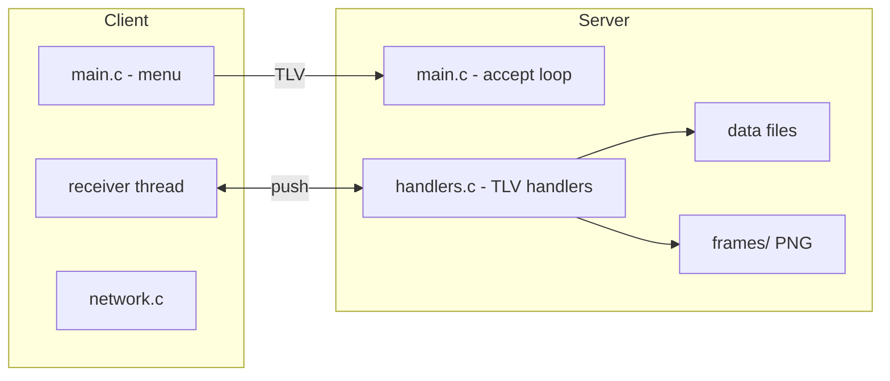
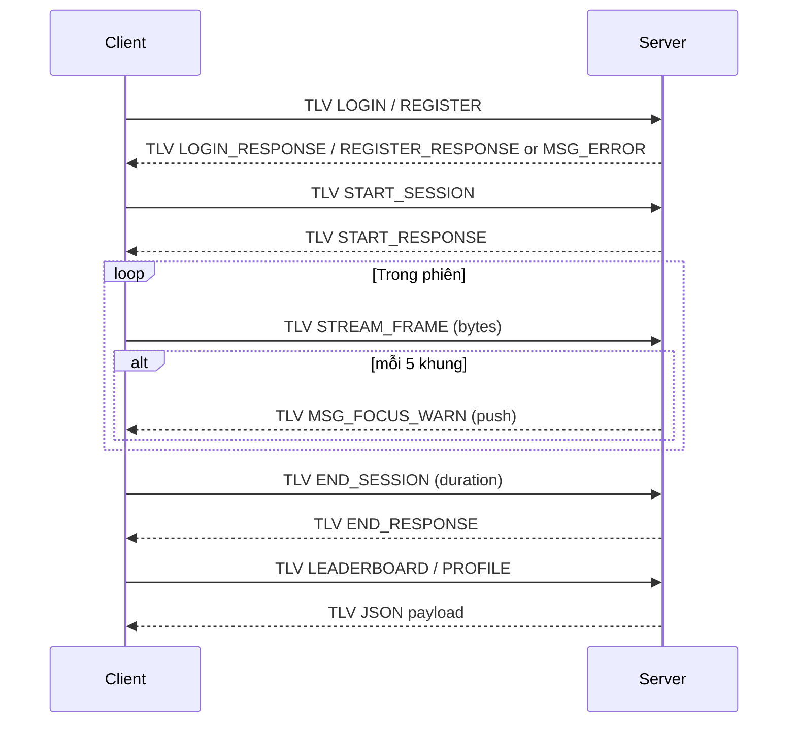

# FocusApp – Client/Server C (Linux, TLV)

Tài liệu mô tả hệ thống console (POSIX) gồm **server TCP đa luồng** và **client TCP** dùng giao thức TLV. Server lưu trữ người dùng/lịch sử ra file, nhận khung hình, phát cảnh báo mất tập trung, cung cấp leaderboard và profile. Mã Windows/WebView cũ vẫn tồn tại nhưng **không còn được dùng**.

## Khởi động nhanh
- Yêu cầu: Linux/WSL, `gcc`, `make`, POSIX socket, `pthread`.
- Build:
	- Server: `cd server && make`
	- Client: `cd client && make`
- Chạy:
	- Server: `./FocusServer` (mặc định `127.0.0.1:12345` trong `common/config.h`)
	- Client: `./FocusClient` rồi làm theo menu console.
- Thư mục dữ liệu tự tạo: `data/users.txt`, `data/history.txt`, `frames/`.

## Kiến trúc tổng quan
- Giao thức: TLV qua TCP, header 8 byte (`int32 type`, `int32 length`), payload tối đa 2MB.
- Server: chấp nhận kết nối, tạo pthread cho mỗi client, bảo vệ trạng thái chung bằng mutex, lưu file người dùng/lịch sử, ghi khung hình vào `frames/`, phát cảnh báo định kỳ.
- Client: menu console, thread nhận nền để nghe thông báo đẩy, bộ đệm phản hồi (mutex+condvar) để đồng bộ lời gọi menu.

## Cấu trúc thư mục (phần đang dùng)
- `common/`
	- `protocol.h`: enum `MessageType`, `PacketHeader`, macro alias `MSG_START_POMO/END_POMO/WARNING/UPDATE_STAT`.
	- `config.h`: host/port, giới hạn kích thước gói.
	- `utils.c`: log, cắt chuỗi, timestamp, random.
- `server/`
	- `main.c`: khởi động, bind/listen, accept, spawn thread.
	- `handlers.c`: recv_all/send_all, send_packet; handler login/register/start/end session/stream frame/leaderboard/profile; tạo thư mục dữ liệu/frames; lưu file; phát cảnh báo.
	- `handlers.h`: `ClientContext`, `SharedState`, khai báo helper.
	- `Makefile`: build Linux `gcc -pthread -o FocusServer`.
- `client/`
	- `main.c`: menu console, thread nhận, bộ đệm phản hồi (mutex+condvar).
	- `network.c/.h`: POSIX socket, TLV send/recv, hàm tiện ích cho từng request.
	- `Makefile`: build Linux `gcc -pthread -o FocusClient`.
- `data/`: `users.txt`, `history.txt` (tự tạo nếu thiếu).
- `frames/`: nơi lưu khung hình nhận từ `MSG_STREAM_FRAME`.

## Đặc tả giao thức TLV
- Header 8 byte (network byte order):
	- `int32 type`: loại thông điệp.
	- `int32 length`: số byte payload.
- Payload: `length` byte (UTF-8 JSON hoặc nhị phân khung hình).
- Giới hạn: `MAX_PACKET_SIZE = 2MB`, `MAX_USERNAME = 64`, `MAX_PASSWORD = 64`.

### MessageType (trong `common/protocol.h`)
- `MSG_HELLO = 1` (dự phòng).
- `MSG_LOGIN_REQUEST = 2`  → JSON `{ "username": "u", "password": "p" }` → đáp `MSG_LOGIN_RESPONSE`.
- `MSG_REGISTER_REQUEST = 3` → JSON như trên → đáp `MSG_REGISTER_RESPONSE`.
- `MSG_START_SESSION = 4` (alias `MSG_START_POMO`) → JSON `{ "username": "u" }` → đáp `MSG_START_RESPONSE`.
- `MSG_END_SESSION = 5` (alias `MSG_END_POMO`) → JSON `{ "username": "u", "duration": N }` → đáp `MSG_END_RESPONSE`.
- `MSG_STREAM_FRAME = 6` → payload nhị phân; server ghi `frames/<user>_frame_<n>.png`; có thể phát `MSG_FOCUS_WARN`.
- `MSG_UPDATE_COINS = 7` (alias `MSG_UPDATE_STAT`) → server push khi coin đổi (chưa bật trong build hiện tại).
- `MSG_FOCUS_WARN = 8` (alias `MSG_WARNING`) → server push cảnh báo (mặc định mỗi 5 khung hình để demo).
- `MSG_LEADERBOARD = 9` → JSON `{ "leaderboard": [{"user": "u", "score": n}] }`.
- `MSG_PROFILE = 10` → JSON `{ "username": "u", "coins": n, "sessions": n, "focus_points": n }`.
- `MSG_ERROR = 11` → chuỗi lỗi.
- `MSG_START_RESPONSE = 12`, `MSG_END_RESPONSE = 13`, `MSG_LOGIN_RESPONSE = 14`, `MSG_REGISTER_RESPONSE = 15`.

### Luồng chính
1) Client gửi `LOGIN`/`REGISTER` với JSON → Server kiểm tra/tạo user, lưu `users.txt`, trả response hoặc `MSG_ERROR`.
2) `START_SESSION` cập nhật trạng thái chung, tăng đếm session.
3) Trong phiên, client có thể gửi nhiều `STREAM_FRAME`; server lưu file, cứ 5 khung sẽ push `MSG_FOCUS_WARN` (demo).
4) `END_SESSION` gửi duration, server kết thúc phiên, ghi `history.txt`.
5) `LEADERBOARD`/`PROFILE` trả JSON dựa trên trạng thái đang giữ (đọc từ file khi khởi động, lưu lại khi thay đổi).

## Luồng xử lý (server thread per client)

## Lưu trữ & file
- `data/users.txt`: mỗi dòng `username password coins sessions focus_points` (plain text, chưa hash).
- `data/history.txt`: ghi append các phiên kết thúc.
- `frames/`: chứa file `user_frame_<n>.png` lưu nguyên bytes nhận được.
- Hàm `ensure_data_dir` và `ensure_frames_dir` tự tạo thư mục nếu chưa có.

## Chi tiết build
- Server Makefile: `gcc -pthread -o FocusServer main.c handlers.c ../common/utils.c -I../common`
- Client Makefile: `gcc -pthread -o FocusClient main.c network.c -I../common`
- Dọn sạch: `make clean` trong từng thư mục.

## Chạy demo mẫu
1) `cd server && ./FocusServer`
2) `cd client && ./FocusClient`
3) Trên client:
	 - Đăng ký người dùng mới
	 - Đăng nhập
	 - Bắt đầu phiên
	 - Gửi vài khung hình (tùy chọn) để thấy cảnh báo mỗi 5 khung
	 - Kết thúc phiên
	 - Xem leaderboard/profile
4) Kiểm tra kết quả: log server, `data/users.txt`, `data/history.txt`, các file trong `frames/`.

## Hạn chế hiện tại / TODO
- Mật khẩu lưu plain text; cần thêm hash + salt.
- Phát hiện mất tập trung đang mô phỏng theo chu kỳ; có thể tích hợp mô hình thực (ONNX, brightness, face detection...).
- Bộ đệm phản hồi trên client đơn giản (1 outstanding); có thể dùng queue để song song nhiều yêu cầu.
- Chưa có TLS, toàn bộ truyền tải là plaintext.

## Checklist kiểm thử nhanh
- Đăng ký mới → OK.
- Đăng ký trùng → nhận `MSG_ERROR`.
- Đăng nhập đúng/sai → phản hồi đúng/sai tương ứng.
- Start session → nhận `MSG_START_RESPONSE`.
- Gửi ≥5 khung → PNG được lưu, nhận ít nhất một `MSG_FOCUS_WARN`.
- End session → `history.txt` thêm bản ghi.
- Leaderboard/Profile → payload JSON hợp lệ.

## Ghi chú
- Toàn bộ đường chạy chính trên Linux/WSL với POSIX socket. Thành phần Windows/WebView còn lại chỉ để tham khảo.
- Header/payload dùng network byte order; hàm `send_all`/`recv_all` để tránh đọc/ghi thiếu.
